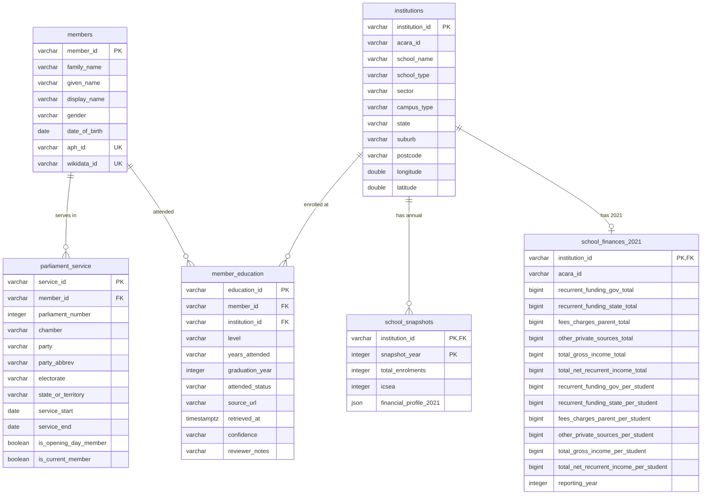

# Canonical Data Model & Repository Layout

This document describes APEMAP's canonical relational data model implemented in DuckDB, its analytical views and table macros, and the repository data directory layout.

---

## 1. Entity-Relationship Diagram



---

## 2. Canonical Tables

The schema is defined in `apemap/schema/01_schema.sql` and initialized in `data/aped.duckdb`:

### `members`
Records unique natural persons who have served in federal parliament.
- `member_id` (`VARCHAR PRIMARY KEY`): Unique internal identifier (e.g. `aph-10001`).
- `family_name` (`VARCHAR NOT NULL`): Member family name.
- `given_name` (`VARCHAR NOT NULL`): Member given name.
- `display_name` (`VARCHAR NOT NULL`): Standard full name (e.g. `"Anthony Albanese"`).
- `gender` (`VARCHAR`): Declared gender (`Male`, `Female`, `Other`).
- `date_of_birth` (`DATE`): Date of birth for age calculation at cohort baselines.
- `aph_id` (`VARCHAR UNIQUE`): Official APH Handbook identifier.
- `wikidata_id` (`VARCHAR UNIQUE`): Wikidata Q-identifier (e.g. `Q348126`).

### `parliament_service`
Records distinct terms of parliamentary service per parliament and chamber.
- `service_id` (`VARCHAR PRIMARY KEY`): Unique service period identifier.
- `member_id` (`VARCHAR NOT NULL REFERENCES members(member_id)`): Member foreign key.
- `parliament_number` (`INTEGER NOT NULL`): Parliament number (e.g. `46`, `47`, `48`).
- `chamber` (`VARCHAR NOT NULL CHECK (chamber IN ('representatives', 'senate'))`): Chamber.
- `party` (`VARCHAR NOT NULL`): Full political party name.
- `party_abbrev` (`VARCHAR NOT NULL`): Standardized party abbreviation (`ALP`, `LP`, `NP`, `GRN`, `IND`, etc.).
- `electorate` (`VARCHAR`): Division represented (House of Representatives only).
- `state_or_territory` (`VARCHAR NOT NULL`): State or Territory represented.
- `service_start` (`DATE`), `service_end` (`DATE`): Term dates.
- `is_opening_day_member` (`BOOLEAN DEFAULT FALSE`): True if sworn in on opening day.
- `is_current_member` (`BOOLEAN DEFAULT FALSE`): True if actively serving at the snapshot date.

### `institutions`
Educational institutions (schools, colleges, academies).
- `institution_id` (`VARCHAR PRIMARY KEY`): Canonical ID (e.g. `acara-40001` or `inst-unmatched-...`).
- `acara_id` (`VARCHAR`): ACARA School Location SML ID.
- `school_name` (`VARCHAR NOT NULL`): Official or normalized school name.
- `school_type` (`VARCHAR`): Type of school (`Primary`, `Secondary`, `Combined`, `Special`).
- `sector` (`VARCHAR NOT NULL CHECK (sector IN ('Government', 'Catholic', 'Independent', 'Tertiary', 'Other'))`): Educational sector.
- `campus_type` (`VARCHAR`): `Main Campus` or `Branch`.
- `state`, `suburb`, `postcode` (`VARCHAR`): Geographic address details.
- `longitude`, `latitude` (`DOUBLE`): GDA2020 / WGS84 geographic coordinates.

### `member_education`
Links parliamentarians to institutions with mandatory audit provenance fields.
- `education_id` (`VARCHAR PRIMARY KEY`): Unique assertion identifier.
- `member_id` (`VARCHAR NOT NULL REFERENCES members(member_id)`): Member reference.
- `institution_id` (`VARCHAR NOT NULL REFERENCES institutions(institution_id)`): Institution reference.
- `level` (`VARCHAR NOT NULL CHECK (level IN ('secondary', 'tertiary'))`): Education level.
- `years_attended` (`VARCHAR`): Textual years attended (e.g. `"1975-1980"`).
- `graduation_year` (`INTEGER`): Explicit graduation year if recorded.
- `attended_status` (`VARCHAR NOT NULL CHECK (attended_status IN ('graduated', 'attended_did_not_graduate', 'attended_unspecified'))`).
- `source_url` (`VARCHAR NOT NULL`): URL or API endpoint where assertion was retrieved.
- `retrieved_at` (`TIMESTAMPTZ NOT NULL`): Timestamp of record retrieval.
- `confidence` (`VARCHAR NOT NULL CHECK (confidence IN ('verified', 'provisional', 'unconfirmed'))`).
- `reviewer_notes` (`VARCHAR`): Human or algorithmic rationale for the match.

### `school_snapshots`
Annual institutional snapshots containing enrolment and socio-educational index values.
- `institution_id` (`VARCHAR NOT NULL REFERENCES institutions(institution_id)`).
- `snapshot_year` (`INTEGER NOT NULL`).
- `total_enrolments` (`INTEGER`).
- `icsea` (`INTEGER`): Index of Community Socio-Educational Advantage.
- `financial_profile_2021` (`JSON`): Extended financial details if present.

### `school_finances_2021`
Historical 2021 school income and recurrent funding metrics isolated from runtime scraping.
- `institution_id` (`VARCHAR PRIMARY KEY REFERENCES institutions(institution_id)`).
- `acara_id` (`VARCHAR NOT NULL`).
- `recurrent_funding_gov_total`, `recurrent_funding_state_total` (`BIGINT`).
- `fees_charges_parent_total`, `other_private_sources_total` (`BIGINT`).
- `total_gross_income_total`, `total_net_recurrent_income_total` (`BIGINT`).
- `recurrent_funding_gov_per_student`, `recurrent_funding_state_per_student` (`BIGINT`).
- `fees_charges_parent_per_student`, `other_private_sources_per_student` (`BIGINT`).
- `total_gross_income_per_student`, `total_net_recurrent_income_per_student` (`BIGINT`).
- `reporting_year` (`INTEGER NOT NULL DEFAULT 2021`).

---

## 3. Canonical Views & Parameterized Macros

Defined in `apemap/schema/02_views.sql`:

### Views
- **`v_parliament_members`**: Joins `parliament_service` with `members` to provide a complete view of parliamentarians and their electoral representation.
- **`v_parliament_members_opening`**: Filters `v_parliament_members` where `is_opening_day_member = TRUE`.
- **`v_parliament_members_current`**: Filters `v_parliament_members` where `is_current_member = TRUE`.
- **`v_member_secondary_education`**: Complete analytical join linking members, their secondary institutions, coordinates, ICSEA, and 2021 financial metrics.

### DuckDB Table Macros
APEMAP defines parameterized DuckDB macros for ergonomic querying:
```sql
-- Query all members of a specific parliament
SELECT * FROM get_parliament_members(47);

-- Query secondary education assertions for a specific parliament
SELECT * FROM get_parliament_education(47);
```

---

## 4. Repository Data Layout

The repository organizes data according to data lifecycle stages:

```text
data/
├── external/                    # Source downloads (read-only upstream assets)
│   ├── ASGS_Ed3_2021_RA_GPKG_GDA2020.zip
│   ├── acara_school_results.json
│   ├── school-location-2022.csv
│   └── school-profile-2022.csv
├── reference/                   # Curated reference files maintained in Git
│   └── school_aliases.json      # Verified school mergers, aliases, and overrides
├── raw/                         # Raw cached responses from external APIs
│   └── aph/
│       └── individuals.json     # Cached APH Handbook API JSON payload
├── processed/                   # Canonical output artifacts generated by CLI
│   ├── *.parquet                # Portable Parquet table exports
│   ├── parliament_*_combined.geojson  # Spatial layers for mapping
│   ├── analysis_report.json     # Deterministic analytical metrics
│   ├── coverage_metrics.json    # Parliament coverage benchmarks
│   └── unmatched_schools.csv    # Unmatched school review queue
├── aped.duckdb                  # Canonical DuckDB database
│
├── [Legacy Research Artifacts]  # Preserved historical files (not canonical)
│   ├── aped.gpkg                # Legacy GeoPackage research artifact
│   ├── aped.db                  # Legacy SQLite/SpatiaLite database
│   ├── analysis.qgz             # Legacy QGIS project file
│   ├── cleaning.qgz             # Legacy QGIS data-cleaning project
│   └── ape/views/*.sql          # Historical SQLite view scripts
```

> [!NOTE]
> **Historical Artifact Notice**:
> Files such as `aped.gpkg`, `aped.db`, and `*.qgz` are legacy artifacts from earlier exploratory stages of the project.
> In early versions of APEMAP, a PostGIS database was converted to GeoPackage using `ogr2ogr -f GPKG aped.gpkg PG:"service=ape" ...`. 
> The modern pipeline replaces this with native DuckDB storage (`data/aped.duckdb`) and deterministic exports (`data/processed/*.parquet` and `data/processed/*.geojson`).
