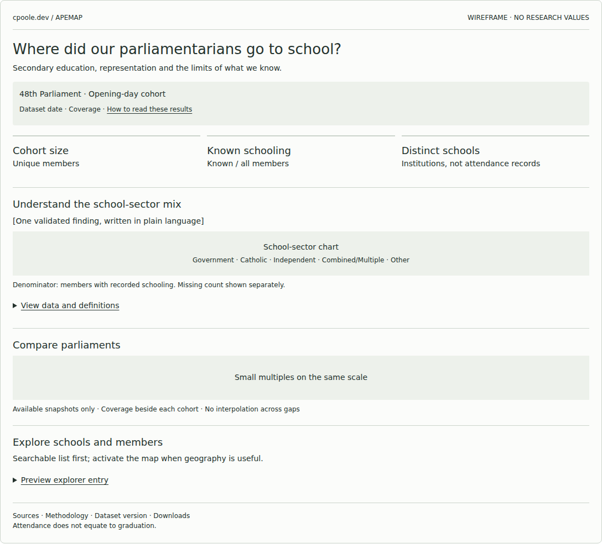
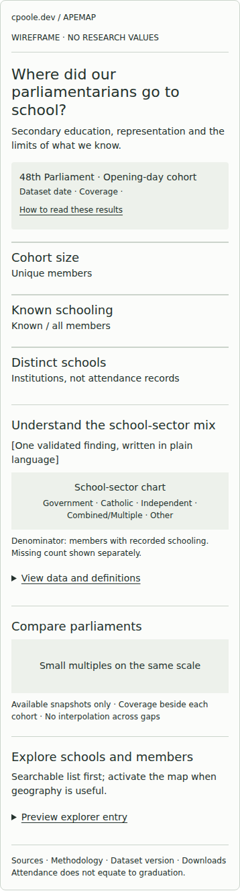
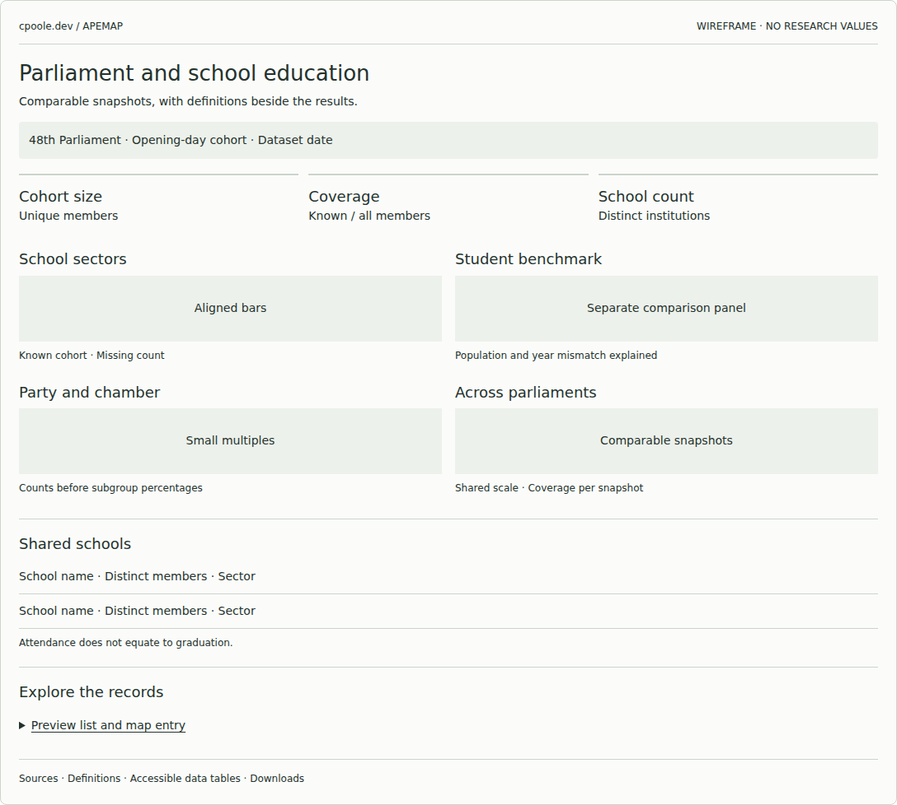
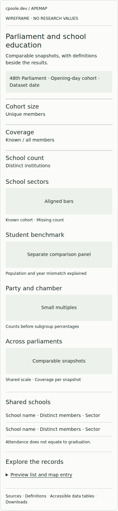
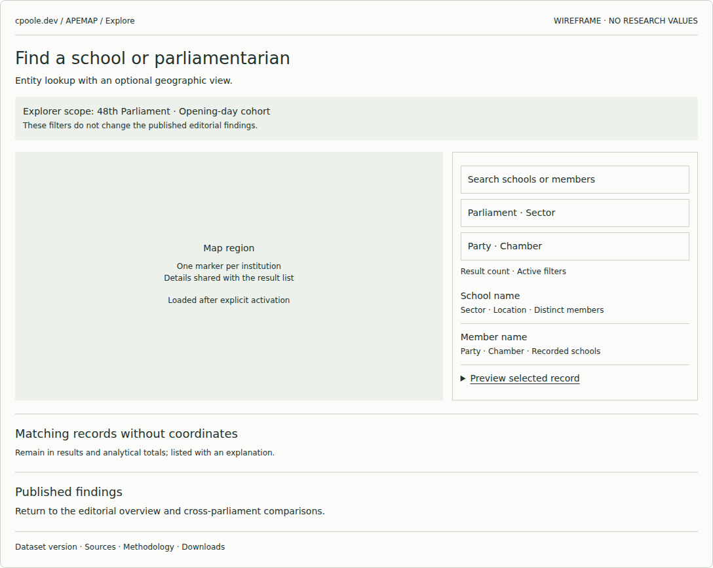
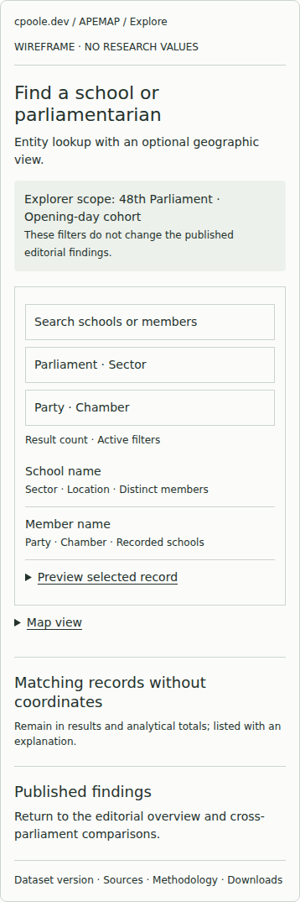

# APEMAP results and explorer wireframes

Initial structural wireframes for [issue #33](https://github.com/Mappboy/apemap/issues/33), published for design review on 29 September 2026. The static-data and hosting architecture remains in [issue #11](https://github.com/Mappboy/apemap/issues/11).

These are low-fidelity layout studies, not research results or a finished application. No numerical research values, geographic features or real school/member records are depicted. Chart areas and search/filter fields are explicitly placeholders. Disclosure panels and layout switching work; data filtering and maps are not implemented.

## Review the layouts

| Layout | Desktop | Mobile | Intended use |
| --- | --- | --- | --- |
| Editorial | [Preview](editorial-desktop.png) | [Preview](editorial-mobile.png) | Recommended main results page: Understand → Compare → Explore |
| Compact report | [Preview](compact-report-desktop.png) | [Preview](compact-report-mobile.png) | Alternative for a denser research summary |
| Explorer | [Preview](explorer-desktop.png) | [Preview](explorer-mobile.png) | Dedicated entity lookup; list first on mobile |

### Editorial

Editorial mobile

### Compact report

Compact research report mobile

### Explorer

Explorer mobile

## Open the responsive version

Download [wireframes.html](wireframes.html) using GitHub's **Download raw file** action and open it in a modern browser. GitHub displays HTML source, not a running preview. The file contains the three-layout carousel and disclosure interactions; narrow browser widths demonstrate the mobile layout. No website deployment is required.

[wireframes.fragment.html](wireframes.fragment.html) preserves the original editable layout fragment. The standalone HTML embeds that fragment in a sandboxed frame with its presentation runtime. These review files do not add runtime dependencies to APEMAP or cpoole-dev.

## Design decisions represented

- Keep editorial findings independent of explorer filters.
- Limit headline cards to cohort size, known schooling coverage and distinct schools.
- Preserve Other, Combined/Multiple and missing schooling as separate analytical concepts; missing coordinates are reported near the map.
- Keep external student benchmarks in a clearly separate comparison context.
- Provide local definitions and table entry points next to charts.
- Keep school/member selection available through a list, including records without coordinates.
- Reserve map loading for explicit activation; never derive national totals from visible map features.

## Next design checkpoint

Select a layout before building a higher-fidelity prototype. Review whether a reader can identify cohort and denominator, compare parliaments, find a school's members, and explain why map coverage differs from analytical coverage.

The next prototype should use a pinned validated dataset or explicitly labelled synthetic fixtures and demonstrate actual filtering, URL state, selection persistence, long names, multiple attendance records, small groups, no results and map failure. Verify those tasks on mobile and without JavaScript. These initial wireframes do not complete all of issue #33's acceptance criteria.

## Validation scope

The publication includes desktop and mobile browser renders of all three variants, carousel/disclosure checks, and a horizontal-overflow check at narrow mobile width. Research data, analysis code, application code and dependency files are unchanged. Repository Python quality gates are not exercised by this design-only publication; no local project environment is present in the publishing workspace.
