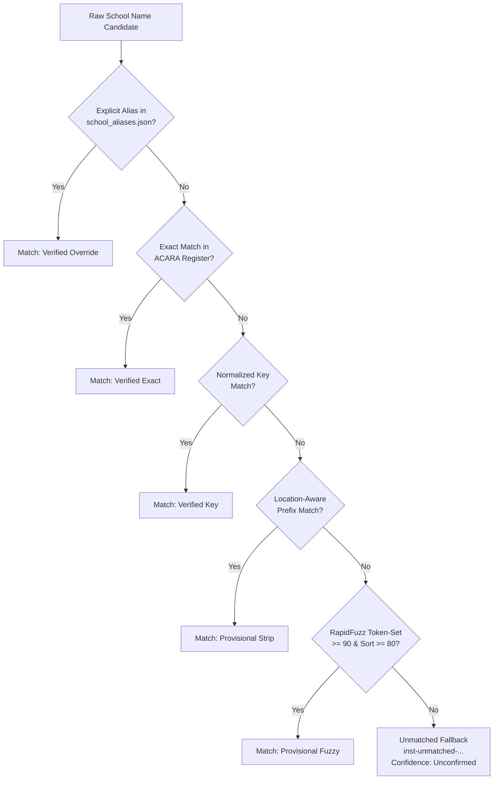

# Research & Processing Methodology

This document details the methodological foundations of APEMAP, including project scope, cohort definitions, education extraction, institutional matching algorithms, data validation gates, and analytical limitations.

---

## 1. Background & Research Motivation

APEMAP was conceived to explore the educational backgrounds of Australian federal parliamentarians and examine institutional linkages across chambers, parties, and parliaments. The project was initially inspired by the [Sydney Morning Herald's 2021 interactive investigation](https://www.smh.com.au/interactive/2021/careers-before-politics/) (*Carter, Yim, Page, Harris, Stehle, Absalom-Wong*), which mapped MPs' pre-political careers and schooling.

Key research questions guiding the project include:
- What proportion of parliamentarians attended Government, Catholic, and Independent secondary schools?
- Which secondary schools have historically or repeatedly produced federal parliamentarians?
- How do parliamentary cohorts vary across opening-day baselines versus end-of-term rosters?
- How do historical school funding levels (e.g. 2021 MySchool financial metrics) correlate descriptively with parliamentary alumni representation?
- Does alumni representation vary significantly between political parties and legislative chambers?

While projects such as Rohan Alexander's R package [`AustralianPoliticians`](https://github.com/RohanAlexander/AustralianPoliticians) provide valuable historical biographical data, APEMAP specifically models the relational links between parliamentarians, secondary institutions, and ACARA educational metrics in a Python- and SQL-agnostic architecture.

---

## 2. Project Scope & Entity Definitions

To ensure analytical rigor, APEMAP strictly defines its core entities:

### Parliamentarian (`members`)
A natural person who has served as an elected Senator or Member of the House of Representatives in the Commonwealth Parliament of Australia. Each individual is represented once by a canonical `member_id`, linked where possible to official identifiers (`aph_id`, `wikidata_id`).

### Parliament
A distinct term of the federal Parliament of Australia, identified by its ordinal number (e.g. 46th Parliament: 2019–2022; 47th Parliament: 2022–2025; 48th Parliament: 2025–present).

### Parliament Service Period (`parliament_service`)
A single, continuous term of service by a parliamentarian within a specific parliament and chamber. Because members may change parties, resign, or contest different seats during a parliament, an individual may hold multiple service records across their career.

### Educational Institution (`institutions`)
A distinct educational facility (school, college, academy, or tertiary institution). Institutions within the Australian primary/secondary system are canonically identified by their ACARA SML ID (`acara_id`). Unmatched or international institutions are assigned deterministic synthetic identifiers (`inst-unmatched-...`).

### Education Assertion (`member_education`)
An explicit assertion that a parliamentarian attended an educational institution. Each assertion records:
- Level of education (`secondary` or `tertiary`)
- Attendance status (`graduated`, `attended_did_not_graduate`, `attended_unspecified`)
- Provenance audit trail (`source_url`, `retrieved_at`, `confidence`, `reviewer_notes`).

---

## 3. Parliament Cohort Definitions

Analyses of parliamentary composition can produce misleading conclusions if cohort baselines are not clearly distinguished. APEMAP formalizes three distinct cohorts:

```
┌─────────────────────────────────────────────────────────────┐
│                    All Service Records                      │
│      (Includes all members, casual vacancies, by-elections)  │
│  ┌──────────────────────────────┬────────────────────────┐  │
│  │    Opening-Day Baseline      │   Current / Final      │  │
│  │  (Sworn in on Day 1 of Parl) │ (Sitting at benchmark) │  │
│  └──────────────────────────────┴────────────────────────┘  │
└─────────────────────────────────────────────────────────────┘
```

1. **Opening-Day Baseline (`is_opening_day_member = TRUE`)**:
   Members sitting on the official opening day of the parliament (e.g. 2019-07-02 for the 46th Parliament; 2022-07-26 for the 47th Parliament). This fixed cohort provides the standard statistical denominator for cross-parliament comparisons (e.g. 227 seats: 151 Reps, 76 Senate).
2. **Current Parliamentarians (`is_current_member = TRUE`)**:
   Members actively serving at the most recent data snapshot date.
3. **All Service Stints**:
   All individuals who served at any point during the parliament, including casual Senate vacancies, by-election winners, and deceased or retired members.

---

## 4. Source Hierarchy & Data Provenance

APEMAP applies a strict source authority hierarchy to ensure data provenance and prevent secondary crowdsourced data from conflicting with official registers:

```
[1. Official APH Handbook API] (Authoritative biographical & parliamentary service source)
            │
            ▼
[2. ACARA Official Registers] (Authoritative school names, SML IDs, coordinates, sectors)
            │
            ▼
[3. Curated School Aliases] (Explicit overrides in data/reference/school_aliases.json)
            │
            ▼
[4. Wikipedia / Wikidata] (Supplementary enrichment, identifier-first linking, QA cross-check)
            │
            ▼
[5. Manual Review & Promotion] (Unmatched school review via data/processed/ review CSVs)
```

1. **Official APH Handbook API**: The Australian Parliament House (APH) Parliamentary Handbook API (`https://handbookapi.aph.gov.au/api/individuals`) is the authoritative source for member identity, parliamentary service, chamber, party, electorate, birth date, gender, and self-reported education text.
2. **ACARA Official Registers**: The Australian Curriculum, Assessment and Reporting Authority (ACARA) School Location and School Profile datasets are the authoritative sources for Australian school identities, SML IDs, coordinates, sectors, and ICSEA values.
3. **Curated Overrides**: `data/reference/school_aliases.json` records verified historical name changes, school amalgamations, and disambiguation rules promoted from manual reviews into deterministic future runs.
4. **Wikipedia / Wikidata Supplementary Enrichment**:
   - **Identifier-first linking**: Parliamentarians are linked to Wikidata entities using their unique Parliament of Australia MP identifier ([Property P10020](https://www.wikidata.org/wiki/Property:P10020)), populating `members.wikidata_id` with a bare QID (e.g. `Q4772000`). Name-based fallback matching is only accepted when unambiguous and confirmed by birth dates.
   - **Non-mutation of official data**: Wikimedia enrichment **never silently overwrites** non-null verified APH demographics (birth dates, gender) or ACARA institutional attributes.
   - **Demographic cross-checks**: Discrepancies and supplemental values available in Wikidata are written to structured review files (`data/processed/wikimedia_member_review.csv`).
   - **Unmatched school suggestions**: Secondary suggestions for unconfirmed or international schools are written to `data/processed/wikimedia_school_review.csv` and remain `unconfirmed` in canonical database tables until promoted through `school_aliases.json`.
5. **Manual Review & Promotion**: Human verification promotes reviewed ambiguous mappings into deterministic pipelines.

---

## 5. Education Extraction Pipeline

APH biographies store education information in unstructured or semi-structured biographical text fields. The extraction pipeline isolates secondary school attendance as follows:

1. **Text Cleansing**: Normalizes Unicode characters, expands common abbreviations, and strips honorifics and titles.
2. **Delimiter Splitting**: Splits composite biography lines on delimiters (`/`, `,`, `;`, `\n`) while respecting parenthetical annotations (e.g. `"St Joseph's College, Hunters Hill"`).
3. **Keyword Filtering**: Matches candidates against secondary school keywords:
   - Positive indicators: `school`, `college`, `grammar`, `high`, `academy`, `secondary`, `matriculation`, `seminary`.
4. **Tertiary Exclusions**: Excludes post-secondary qualifications and institutions:
   - Exclusions: `university`, `tafe`, `bachelor`, `master`, `doctor`, `phd`, `diploma`, `certificate`, `college of law`, `royal military college`, `college of advanced education`.
5. **Attendance Status Detection**: Parses textual qualifiers such as `"left Year 9"` or `"attended"` into structured statuses (`graduated`, `attended_did_not_graduate`, `attended_unspecified`).

---

## 6. Institutional Matching Algorithm

Once school candidate strings are extracted, they are resolved against ACARA's canonical institutional register using a multi-tier matching cascade:



### Matching Tiers

1. **Tier 0: Explicit Alias Override (`confidence = 'verified'`)**
   Evaluates `data/reference/school_aliases.json` to resolve historical amalgamations (e.g. schools that merged or changed names) and known ambiguous names.
2. **Tier 1: Exact Name Match (`confidence = 'verified'`)**
   Case-insensitive exact match against ACARA official school names.
3. **Tier 2: Normalized Key Match (`confidence = 'verified'`)**
   Matches normalised tokens after stripping whitespace, punctuation, and common stopwords.
4. **Tier 3: Location-Aware Match (`confidence = 'provisional'`)**
   Strips geographic suffixes (e.g. `"Wesley College, Melbourne"` -> `"Wesley College"`) and verifies whether the stripped entity exists unambiguously.
5. **Tier 4: RapidFuzz Token-Set Scoring (`confidence = 'provisional'`)**
   Applies `rapidfuzz.fuzz.token_set_ratio` against candidate keys:
   - Threshold requirement: `token_set_ratio >= 90.0` **and** `token_sort_ratio >= 80.0`.
   - Generates reviewer notes recording the matching score and candidate name.
6. **Tier 5: Unmatched Fallback (`confidence = 'unconfirmed'`)**
   If no threshold is met:
   - Assigns a deterministic synthetic ID: `inst-unmatched-{slug[:40]}`.
   - Detects international institutions using geographic keyword lists (`uk`, `usa`, `nz`, `canada`, `singapore`, etc.).
   - Assigns sector `'Other'`.
   - Records the raw candidate name and writes it to `data/processed/unmatched_schools.csv` for human review.

### Historical Context: Evolution of School Identification
In the project's early exploratory phase, missing schools were discovered through manual web searches (Wikipedia, LinkedIn, news profiles). This initial QA surfaced known biographical gaps (for example, ministers and senators whose schools were originally unrecorded or ambiguous in early datasets, such as Alex Antic, Arthur Sinodinos, Graham Perrett, Peter Khalil, and Llew O'Brien).
Under the modern pipeline, manual searches have been replaced by the automated matching cascade, and any remaining gaps are captured programmatically in `data/processed/unmatched_schools.csv`.

---

## 7. ACARA Integration & Longitudinal Data

Institutions matched to an ACARA SML ID inherit authoritative metadata from the ACARA Data Access portal:
- **Sector**: `Government`, `Catholic`, `Independent`, or `Other`
- **School Type**: `Primary`, `Secondary`, `Combined`, or `Special`
- **Campus Type**: `Main Campus` or `Branch`
- **Geographic Location**: Latitude, longitude, suburb, state, postcode
- **Annual Metrics (`school_snapshots`)**: Total enrolments, ICSEA (Index of Community Socio-Educational Advantage).

---

## 8. Historical 2021 Financial Data Treatment

APEMAP includes a dedicated table, `school_finances_2021`, containing school-level income and recurrent funding metrics derived from ACARA MySchool reporting for the 2021 calendar year.

> [!WARNING]
> **Temporal Disconnect Warning**:
> The 2021 financial figures reflect funding and parental fees for the year 2021. They do **not** represent funding levels contemporaneous with when parliamentarians attended school (which typically occurred between the 1960s and 2000s). 
> 
> In all analyses, 2021 finances are treated strictly as an indicator of modern institutional resource profiles, not historical student expenditure.

---

## 9. Automated Integrity & Coverage Gates

Database consistency is validated by `apemap validate`, which enforces 11 mandatory checks:
1. Primary key uniqueness across all canonical tables.
2. Foreign key referential integrity (`parliament_service.member_id` -> `members.member_id`).
3. Foreign key referential integrity (`member_education.member_id` -> `members.member_id`).
4. Foreign key referential integrity (`member_education.institution_id` -> `institutions.institution_id`).
5. Non-null assertions on required display and biographical fields.
6. Valid chamber enumeration (`representatives`, `senate`).
7. Valid school sector enumeration (`Government`, `Catholic`, `Independent`, `Tertiary`, `Other`).
8. Valid attendance status enumeration (`graduated`, `attended_did_not_graduate`, `attended_unspecified`).
9. Valid confidence enumeration (`verified`, `provisional`, `unconfirmed`).
10. Parliament benchmark seat coverage (e.g. 227 opening-day seats for 46th and 47th Parliaments).
11. Coordinates validity for geocoded institutions (valid latitude/longitude bounds for Australia).

---

## 10. Analytical Limitations & Caveats

Users of APEMAP data should consider the following limitations:

1. **Biographical Gaps**: Education records are self-reported by parliamentarians to the Parliamentary Handbook. Incomplete entries exist where parliamentarians chose not to report secondary schooling.
2. **Amalgamations and Closures**: Schools frequently merge, change names, or close. While `data/reference/school_aliases.json` accounts for common mergers, historical institutional continuity is complex.
3. **Multi-Campus Institutions**: Certain schools operate multiple campuses across cities or states. Where specific campus details are omitted in biographies, records are linked to the primary administrative campus.
4. **International Schools**: Parliamentarians educated overseas are matched to synthetic unconfirmed institution records and excluded from domestic sector distributions.
5. **Descriptive, Non-Causal Nature**: Relationships between parliamentarian schooling and political outcomes are descriptive observations. They should not be interpreted as evidence of causal mechanisms.
