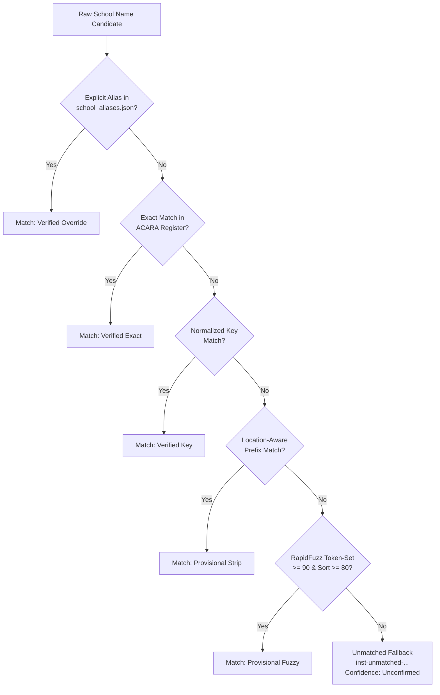

# Research & Processing Methodology

This document details the methodological foundations of APEMAP, including project scope, cohort definitions, education extraction, institutional matching algorithms, data validation gates, and analytical limitations.

---

## 1. Background & Research Motivation

APEMAP was conceived to explore the educational backgrounds of Australian federal parliamentarians and examine institutional linkages across chambers, parties, and parliaments. The project was initially inspired by the [Sydney Morning Herald's 2021 interactive investigation](https://www.smh.com.au/interactive/2021/careers-before-politics/) (*Carter, Yim, Page, Harris, Stehle, Absalom-Wong*), which mapped MPs' pre-political careers and schooling.

Key research questions guiding the project include:
- What proportion of parliamentarians attended Government, Catholic, and Independent secondary schools?
- Which secondary schools have historically or repeatedly produced federal parliamentarians?
- How do parliamentary cohorts vary across opening-day baselines versus end-of-term rosters?
- How do historical school funding levels (e.g. 2021 MySchool financial metrics) correlate descriptively with parliamentary alumni representation?
- Does alumni representation vary significantly between political parties and legislative chambers?

While projects such as Rohan Alexander's R package [`AustralianPoliticians`](https://github.com/RohanAlexander/AustralianPoliticians) provide valuable historical biographical data, APEMAP specifically models the relational links between parliamentarians, secondary institutions, and ACARA educational metrics in a Python- and SQL-agnostic architecture.

---

## 2. Project Scope & Entity Definitions

To ensure analytical rigor, APEMAP strictly defines its core entities:

### Parliamentarian (`members`)
A natural person who has served as an elected Senator or Member of the House of Representatives in the Commonwealth Parliament of Australia. Each individual is represented once by a canonical `member_id`, linked where possible to official identifiers (`aph_id`, `wikidata_id`).

### Parliament
A distinct term of the federal Parliament of Australia, identified by its ordinal number (e.g. 46th Parliament: 2019–2022; 47th Parliament: 2022–2025; 48th Parliament: 2025–present).

### Parliament Service Period (`parliament_service`)
A single, continuous term of service by a parliamentarian within a specific parliament and chamber. Because members may change parties, resign, or contest different seats during a parliament, an individual may hold multiple service records across their career.

### Educational Institution (`institutions`)
A distinct educational facility (school, college, academy, or tertiary institution). Institutions within the Australian primary/secondary system are canonically identified by their ACARA SML ID (`acara_id`). Unmatched or international institutions are assigned deterministic synthetic identifiers (`inst-unmatched-...`).

### Education Assertion (`member_education`)
An explicit assertion that a parliamentarian attended an educational institution. Each assertion records:
- Level of education (`secondary` or `tertiary`)
- Attendance status (`graduated`, `attended_did_not_graduate`, `attended_unspecified`)
- Provenance audit trail (`source_url`, `retrieved_at`, `confidence`, `reviewer_notes`).

---

## 3. Parliament Cohort Definitions

Analyses of parliamentary composition can produce misleading conclusions if cohort baselines are not clearly distinguished. APEMAP formalizes three distinct cohorts:

```
┌─────────────────────────────────────────────────────────────┐
│                    All Service Records                      │
│      (Includes all members, casual vacancies, by-elections)  │
│  ┌──────────────────────────────┬────────────────────────┐  │
│  │    Opening-Day Baseline      │   Current / Final      │  │
│  │  (Sworn in on Day 1 of Parl) │ (Sitting at benchmark) │  │
│  └──────────────────────────────┴────────────────────────┘  │
└─────────────────────────────────────────────────────────────┘
```

1. **Opening-Day Baseline (`is_opening_day_member = TRUE`)**:
   Members sitting on the official opening day of the parliament (e.g. 2019-07-02 for the 46th Parliament; 2022-07-26 for the 47th Parliament). This fixed cohort provides the standard statistical denominator for cross-parliament comparisons (e.g. 227 seats: 151 Reps, 76 Senate).
2. **Current Parliamentarians (`is_current_member = TRUE`)**:
   Members actively serving at the most recent data snapshot date.
3. **All Service Stints**:
   All individuals who served at any point during the parliament, including casual Senate vacancies, by-election winners, and deceased or retired members.

---

## 4. Source Hierarchy & Data Provenance

APEMAP applies a strict source authority hierarchy to ensure data provenance and prevent secondary crowdsourced data from conflicting with official registers:

```
[1. Official APH Handbook API] (Authoritative biographical & parliamentary service source)
            │
            ▼
[2. ACARA Official Registers] (Authoritative school names, SML IDs, coordinates, sectors)
            │
            ▼
[3. Curated School Aliases] (Explicit overrides in data/reference/school_aliases.json)
            │
            ▼
[4. Wikipedia / Wikidata] (Supplementary enrichment, identifier-first linking, QA cross-check)
            │
            ▼
[5. Manual Review & Promotion] (Unmatched school review via data/processed/ review CSVs)
```

1. **Official APH Handbook API**: The Australian Parliament House (APH) Parliamentary Handbook API (`https://handbookapi.aph.gov.au/api/individuals`) is the authoritative source for member identity, parliamentary service, chamber, party, electorate, birth date, gender, and self-reported education text.
2. **ACARA Official Registers**: The Australian Curriculum, Assessment and Reporting Authority (ACARA) School Location and School Profile datasets are the authoritative sources for Australian school identities, SML IDs, coordinates, sectors, and ICSEA values.
3. **Curated Overrides**: `data/reference/school_aliases.json` records verified historical name changes, school amalgamations, and disambiguation rules promoted from manual reviews into deterministic future runs.
4. **Wikipedia / Wikidata Supplementary Enrichment**:
   - **Identifier-first linking**: Parliamentarians are linked to Wikidata entities using their unique Parliament of Australia MP identifier ([Property P10020](https://www.wikidata.org/wiki/Property:P10020)), populating `members.wikidata_id` with a bare QID (e.g. `Q4772000`). Name-based fallback matching is only accepted when unambiguous and corroborated by birth date or Australian political context; ambiguous single candidates are flagged for review rather than auto-linked.
   - **Non-mutation of official data**: Wikimedia enrichment **never silently overwrites** non-null verified APH demographics (birth dates, gender) or ACARA institutional attributes. APH and ACARA remain authoritative.
   - **Automated candidate sanity filtering**: Unmatched school suggestions undergo automated sanity filtering before reaching human reviewers. Suggestions are rejected if they represent non-school entity types (`human`, `town`, `suburb`, `city`, `list article`, `disambiguation page`, `religious order`, `company`, etc.), fall outside Australian geographic bounds (unless verified as international), or fail token similarity thresholds (`similarity < 70` without supporting historical evidence).
   - **Demographic cross-checks & school suggestions**: Discrepancies and supplemental values available in Wikidata are written to `data/processed/wikimedia_member_review.csv`. Filtered school suggestions are written to `data/processed/wikimedia_school_review.csv`. Both remain `unconfirmed` in canonical database tables until promoted.
5. **Manual Review & Promotion**:
   - **CSV-based review storage**: Manual decisions are recorded directly in the review CSVs via explicit decision columns (`review_status`, `resolved_*`, `manual_source_url`, `review_notes`).
   - **Allowed statuses**: Review decisions use a controlled vocabulary: `pending`, `accepted`, `rejected`, and `needs_research`.
   - **Idempotent rerun preservation**: Rerunning `apemap ingest wikimedia` never deletes manual review decisions. A key-based merge preserves existing decisions and user notes while updating generated candidate columns and pruning obsolete unreviewed candidates.
   - **Promotion via `school_aliases.json`**: Accepted school mappings are promoted into `data/reference/school_aliases.json` where they flow deterministically into subsequent pipeline runs (`apemap ingest aph`). Review decisions are tracked through Git history without requiring bespoke database review tables or web curation frameworks.

---

## 5. Education Extraction Pipeline

APH biographies store education information in unstructured or semi-structured biographical text fields. The extraction pipeline isolates secondary school attendance as follows:

1. **Text Cleansing**: Normalizes Unicode characters, expands common abbreviations, and strips honorifics and titles.
2. **Delimiter Splitting**: Splits composite biography lines on delimiters (`/`, `,`, `;`, `\n`) while respecting parenthetical annotations (e.g. `"St Joseph's College, Hunters Hill"`).
3. **Keyword Filtering**: Matches candidates against secondary school keywords:
   - Positive indicators: `school`, `college`, `grammar`, `high`, `academy`, `secondary`, `matriculation`, `seminary`.
4. **Tertiary Exclusions**: Excludes post-secondary qualifications and institutions:
   - Exclusions: `university`, `tafe`, `bachelor`, `master`, `doctor`, `phd`, `diploma`, `certificate`, `college of law`, `royal military college`, `college of advanced education`.
5. **Attendance Status Detection**: Parses textual qualifiers such as `"left Year 9"` or `"attended"` into structured statuses (`graduated`, `attended_did_not_graduate`, `attended_unspecified`).

---

## 6. Institutional Matching Algorithm

Once school candidate strings are extracted, they are resolved against ACARA's canonical institutional register using a multi-tier matching cascade:


```mermaid
flowchart TD
    Raw[Raw School Name Candidate] --> Step0{Explicit Alias in<br/>school_aliases.json?}
    Step0 -- Yes --> Match0[Match: Verified Override]
    Step0 -- No --> Step1{Exact Match in<br/>ACARA Register?}
    Step1 -- Yes --> Match1[Match: Verified Exact]
    Step1 -- No --> Step2{Normalized Key<br/>Match?}
    Step2 -- Yes --> Match2[Match: Verified Key]
    Step2 -- No --> Step3{Location-Aware<br/>Prefix Match?}
    Step3 -- Yes --> Match3[Match: Provisional Strip]
    Step3 -- No --> Step4{RapidFuzz Token-Set<br/>>= 90 & Sort >= 80?}
    Step4 -- Yes --> Match4[Match: Provisional Fuzzy]
    Step4 -- No --> Step5[Unmatched Fallback<br/>inst-unmatched-...<br/>Confidence: Unconfirmed]
```

### Matching Tiers

1. **Tier 0: Explicit Alias Override (`confidence = 'verified'`)**
   Evaluates `data/reference/school_aliases.json` to resolve historical amalgamations (e.g. schools that merged or changed names) and known ambiguous names.
2. **Tier 1: Exact Name Match (`confidence = 'verified'`)**
   Case-insensitive exact match against ACARA official school names.
3. **Tier 2: Normalized Key Match (`confidence = 'verified'`)**
   Matches normalised tokens after stripping whitespace, punctuation, and common stopwords.
4. **Tier 3: Location-Aware Match (`confidence = 'provisional'`)**
   Strips geographic suffixes (e.g. `"Wesley College, Melbourne"` -> `"Wesley College"`) and verifies whether the stripped entity exists unambiguously.
5. **Tier 4: RapidFuzz Token-Set Scoring (`confidence = 'provisional'`)**
   Applies `rapidfuzz.fuzz.token_set_ratio` against candidate keys:
   - Threshold requirement: `token_set_ratio >= 90.0` **and** `token_sort_ratio >= 80.0`.
   - Generates reviewer notes recording the matching score and candidate name.
6. **Tier 5: Unmatched Fallback (`confidence = 'unconfirmed'`)**
   If no threshold is met:
   - Assigns a deterministic synthetic ID: `inst-unmatched-{slug[:40]}`.
   - Detects international institutions using geographic keyword lists (`uk`, `usa`, `nz`, `canada`, `singapore`, etc.).
   - Assigns sector `'Other'`.
   - Records the raw candidate name and writes it to `data/processed/unmatched_schools.csv` for human review.

### Historical Context: Evolution of School Identification
In the project's early exploratory phase, missing schools were discovered through manual web searches (Wikipedia, LinkedIn, news profiles). This initial QA surfaced known biographical gaps (for example, ministers and senators whose schools were originally unrecorded or ambiguous in early datasets, such as Alex Antic, Arthur Sinodinos, Graham Perrett, Peter Khalil, and Llew O'Brien).
Under the modern pipeline, manual searches have been replaced by the automated matching cascade, and any remaining gaps are captured programmatically in `data/processed/unmatched_schools.csv`.

---

## 7. ACARA Integration & Longitudinal Data

Institutions matched to an ACARA SML ID inherit authoritative metadata from the ACARA Data Access portal:
- **Sector**: `Government`, `Catholic`, `Independent`, or `Other`
- **School Type**: `Primary`, `Secondary`, `Combined`, or `Special`
- **Campus Type**: `Main Campus` or `Branch`
- **Geographic Location**: Latitude, longitude, suburb, state, postcode
- **Annual Metrics (`school_snapshots`)**: Total enrolments, ICSEA (Index of Community Socio-Educational Advantage).

---

## 8. School Financial Data Treatment & Annual Modelling

APEMAP models school-level finances in a canonical annual table, `school_finances`, keyed by `(institution_id, reporting_year)`.

### Attribution and Terms of Use
All published analyses and visualizations derived from My School finance must carry the mandatory ACARA attribution:
> *Source: Australian Curriculum, Assessment and Reporting Authority (ACARA)*

Finance records are processed in strict accordance with the My School Terms of Use (July 2020), which permit internal educational and non-commercial research use while restricting public republication of the raw school-level collection without prior written consent. Raw authorized school-level extracts are maintained locally and excluded from Git version control.

### Multi-Campus Rolled Reporting
Certain multi-campus educational institutions submit financial reporting aggregated at the parent school entity or main campus level. Rather than silently categorizing secondary or branch campuses as missing financial data, APEMAP marks rolled reporting entities with `is_rolled_reporting = TRUE` and links `parent_acara_id`.

### Distinction from Supplementary Jurisdictional Funding
Supplementary public datasets (such as NSW RAM or Tasmanian School Resource Package allocations) measure state-specific resourcing formulas. Because these funding models do not correspond directly to ACARA's national total gross income or net recurrent income methodology, they are modelled and presented under distinct metric definitions.

> [!WARNING]
> **Temporal Disconnect Warning**:
> The financial figures reflect funding and parental contributions for the stated reporting year (e.g. 2021). They do **not** represent funding levels contemporaneous with when parliamentarians attended school (which typically occurred between the 1960s and 2000s). 
> 
> In all analyses, modern finances are treated strictly as an indicator of modern institutional resource profiles, not historical student expenditure.

---

## 9. Public School Funding, ACARA Benchmark Estimation & Backtesting

To provide up-to-date, attributable financial context across the interactive map while exact school-level 2024 ACARA figures are being acquired or restricted, APEMAP implements an **empirical benchmark estimation and public funding integration framework**.

### Source Precedence
For any school-level finance metric:
1. **Observed Authoritative School-Level Value**: Direct observation from ACARA My School finance (`status = "observed"`, `method = "direct_observation"`). Never overwritten by estimates.
2. **Public Jurisdictional School-Level Allocations**: Supplemental state/territory funding programs (e.g. NSW RAM, Tasmania SRP, NT Needs-Based Formula). Preserved as distinct properties, never combined numerically with ACARA income measures.
3. **Indexed ACARA Benchmark Estimate**: Estimated value scaled from historical school actuals using official ACARA peer group movements (`status = "estimated_indexed"`).
4. **ACARA Peer-Group Benchmark Average**: Unweighted peer average when historical actuals are absent or backtesting group dispersion is too high (`status = "benchmark_average"`).
5. **Unavailable**: When neither observed finance nor peer benchmarks can be matched (`status = "unavailable"`).

### Estimation Formula & Worked Example
For a target year $t_{target}$ (e.g. 2024) and baseline historical year $t_{hist}$ (e.g. 2021):
1. **Peer Group Benchmark**: School $i$ is assigned a peer benchmark $B_{\text{peer}}$ based on its tuple:
   $$\text{Peer Group} = (\text{State}, \text{Sector}, \text{ASGS Remoteness Geolocation})$$
   Hierarchical fallback resolves sparse combinations:
   $$(\text{State}, \text{Sector}, \text{Geo}) \rightarrow (\text{State}, \text{Sector}, \text{All}) \rightarrow (\text{All}, \text{Sector}, \text{Geo}) \rightarrow (\text{All}, \text{Sector}, \text{All})$$

2. **Relative Multiplier**: The school's historical relative position against its peer group is computed:
   $$R_i = \frac{Y_{i, t_{hist}}}{B_{\text{peer}, t_{hist}}}$$

3. **Target Estimate**:
   $$\hat{Y}_{i, t_{target}} = B_{\text{peer}, t_{target}} \times R_i$$

**Worked Example**:
- School: Independent secondary school in Major Cities NSW.
- 2021 School Actual: $29,991 per student.
- 2021 NSW Independent Major Cities Benchmark: $28,702 per student.
- Multiplier: $R = 29,991 / 28,702 = 1.0449$ (+4.5% above peer benchmark).
- 2024 NSW Independent Major Cities Benchmark: $29,765 per student.
- 2024 Indexed Estimate: $29,765 \times 1.0449 = \$31,101$ per student (`status = "estimated_indexed"`).

### Backtesting Validation Against Historical Actuals
The benchmark indexing methodology is empirically backtested against observed historical school finances (2021 baseline across 259 schools):
- **Median Ratio**: $\text{median}(\text{actual} / \text{benchmark}) = 1.0007$ (demonstrating zero systematic bias across the cohort).
- **Median Absolute Deviation (MAD)**: $0.1203$ (12.0% median relative dispersion).
- **Median Absolute Percentage Error (MAPE)**: $11.9\%$.
- **High-Dispersion Group Fallback**: Groups where MAD exceeds $0.25$ or sample size is insufficient are classified as high dispersion (`"high_dispersion"`). For these groups, individual school indexing is suppressed, and the map explicitly presents the peer-group average (`"benchmark_average"`).

---

## 10. Government vs. Non-Government Classification & Three Explicit Denominators

Public debate often reduces school attendance to a binary comparison between public and private education. However, parliamentarians frequently attended more than one secondary school across sectors. To ensure total transparency and statistical reproducibility, APEMAP defines both individual member classification rules and three distinct analytical denominators.

### Member-Level Sector Classification
Each parliamentarian is classified into one mutually exclusive category based on the sectors of all secondary schools they attended:
- **`government_only`**: The parliamentarian attended only Government (public) secondary institutions.
- **`non_government_only`**: The parliamentarian attended only Non-government secondary institutions (Catholic and/or Independent). For example, a student who attended both a Catholic systemic school and an Independent grammar school remains classified as `non_government_only`.
- **`mixed`**: The parliamentarian attended at least one Government secondary school **and** at least one Non-government (Catholic or Independent) secondary school.
- **`other`**: The parliamentarian attended only unclassified or non-standard educational institutions.
- **`no_school_recorded`**: The parliamentarian has no recorded secondary school attendance in the Parliamentary Handbook or official biographies.

### Three Explicit Denominators
Because a single parliamentarian can attend multiple schools, and multiple parliamentarians can attend the same school, percentages must be explicitly anchored to clear denominators:
1. **Known Parliamentarians Denominator (`known_school_denominator`)**:
   $$\text{Denominator}_1 = \text{Total Parliamentarians} - \text{No School Recorded}$$
   This serves as the primary denominator for headline proportions (e.g. "% of known MPs who attended non-government schools"). Parliamentarians with no recorded education are excluded from this denominator to avoid artificially depressing attendance rates.
2. **Attendance Instances Denominator (`total_attendance_instances`)**:
   $$\text{Denominator}_2 = \sum \text{Member-to-School Attendance Records}$$
   Counts every instance of a member attending a school. A parliamentarian who attended two schools contributes two instances to this denominator. Useful for examining institutional representation without forcing single-choice member pigeonholing.
3. **Represented Unique Schools Denominator (`total_unique_schools`)**:
   $$\text{Denominator}_3 = \text{Count of Distinct Physical Institutions Attended}$$
   Measures institutional diversity and concentration by evaluating the unique set of schools attended by the parliamentary cohort.

---

## 11. Automated Integrity & Coverage Gates

Database consistency is validated by `apemap validate`, which enforces 11 mandatory checks:
1. Primary key uniqueness across all canonical tables.
2. Foreign key referential integrity (`parliament_service.member_id` -> `members.member_id`).
3. Foreign key referential integrity (`member_education.member_id` -> `members.member_id`).
4. Foreign key referential integrity (`member_education.institution_id` -> `institutions.institution_id`).
5. Non-null assertions on required display and biographical fields.
6. Valid chamber enumeration (`representatives`, `senate`).
7. Valid school sector enumeration (`Government`, `Catholic`, `Independent`, `Tertiary`, `Other`).
8. Valid attendance status enumeration (`graduated`, `attended_did_not_graduate`, `attended_unspecified`).
9. Valid confidence enumeration (`verified`, `provisional`, `unconfirmed`).
10. Parliament benchmark seat coverage (e.g. 227 opening-day seats for 46th and 47th Parliaments).
11. Coordinates validity for geocoded institutions (valid latitude/longitude bounds for Australia).

---

## 12. Analytical Limitations & Caveats

Users of APEMAP data should consider the following limitations:

1. **Biographical Gaps**: Education records are self-reported by parliamentarians to the Parliamentary Handbook. Incomplete entries exist where parliamentarians chose not to report secondary schooling.
2. **Amalgamations and Closures**: Schools frequently merge, change names, or close. While `data/reference/school_aliases.json` accounts for common mergers, historical institutional continuity is complex.
3. **Multi-Campus Institutions**: Certain schools operate multiple campuses across cities or states. Where specific campus details are omitted in biographies, records are linked to the primary administrative campus.
4. **International Schools**: Parliamentarians educated overseas are matched to synthetic unconfirmed institution records and excluded from domestic sector distributions.
5. **Descriptive, Non-Causal Nature**: Relationships between parliamentarian schooling and political outcomes are descriptive observations. They should not be interpreted as evidence of causal mechanisms.

